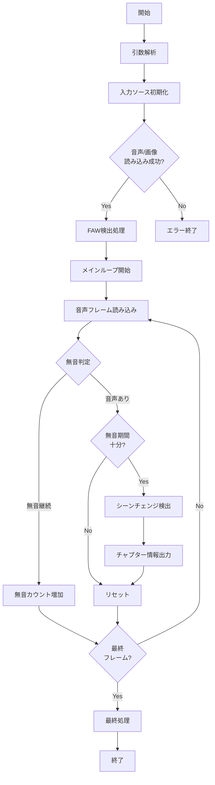

# chapter_exe 詳細技術ドキュメント

## 1. プログラム概要

chapter_exeは、動画ファイルの無音部分とシーンチェンジを自動検出し、チャプター情報を生成するCLIツールです。主に日本のテレビ放送コンテンツの処理を想定しており、CM検出や番組境界の識別に活用されます。

### 主要機能
- **無音検出**: 音声レベルが閾値以下の区間を検出
- **シーンチェンジ検出**: 画像の急激な変化を検出
- **チャプター生成**: 検出結果を元にチャプター情報を出力
- **FAW対応**: FAW（Fake AAC Wrapper）形式の音声デコード

## 2. アーキテクチャ

### 2.1 全体構造

```
┌───────────────────────────────────────────────────┐
│                 メインプロセス                    │
│               (chapter_exe.cpp)                   │
├───────────────────────────────────────────────────┤
│  入力層           │  処理層        │   出力層     │
├───────────────────┼────────────────┼──────────────┤
│ - AviSynthソース  │ - 無音検出     │ - チャプター │
│ - WAVソース       │ - SC検出       │   ファイル   │
│ - AUIプラグイン   │ - FAWデコード  │              │
└───────────────────┴────────────────┴──────────────┘
```

### 2.2 モジュール構成

#### コアモジュール
1. **chapter_exe.cpp** - メインプログラム
2. **mvec.cpp** - 動きベクトル検出とシーンチェンジ判定
3. **source.h** - 入力ソース抽象化層
4. **faw.h** - FAWデコーダー
5. **input.h** - AviUtlプラグインインターフェース
6. **compat.h** - Windows/Linux互換性レイヤー

## 3. 詳細仕様

### 3.1 コマンドライン引数

```bash
chapter_exe -v 入力画像ファイル -a 入力音声ファイル -o 出力テキスト [オプション]
```

| 引数     | 説明                       | デフォルト値 |
| -------- | -------------------------- | ------------ |
| -v       | 入力画像ファイル（必須）   | -            |
| -a       | 入力音声ファイル           | 画像と同じ   |
| -o       | 出力ファイル（必須）       | -            |
| -m       | 無音判定閾値（1～32767）   | 50           |
| -s       | 最低無音フレーム数         | 10           |
| -b       | 無音シーン検索間隔数       | 60           |
| -e       | 無音前後検索拡張フレーム数 | 1            |
| --debug  | デバッグモード             | off          |
| --thin   | 音声読み込み間引き強制     | auto         |
| --serial | 音声連続読み込み強制       | auto         |

### 3.2 処理フロー



### 3.3 無音検出アルゴリズム

```c++
// 疑似コード
for each audio_frame {
    samples = read_audio(frame)
    max_volume = 0
    
    for each sample in samples {
        volume = abs(sample)
        if (volume > max_volume) {
            max_volume = volume
        }
    }
    
    if (max_volume <= mute_threshold) {
        mute_counter++
    } else {
        if (mute_counter >= minimum_mute_frames) {
            // 無音区間として処理
            process_mute_section()
        }
        mute_counter = 0
    }
}
```

### 3.4 シーンチェンジ検出アルゴリズム

#### 3.4.1 動きベクトル検出
- **手法**: 階層的ブロックマッチング
- **ブロックサイズ**: 16×16ピクセル
- **探索範囲**: ±32ピクセル
- **最適化**: SSE2命令セット使用

#### 3.4.2 判定基準
```c++
// 主要な判定パラメータ
RATE_SCENE_CHANGE = 100         // シーンチェンジ判定閾値（‰）
RATE_SCENE_CHGLOW = 50          // 検出不明時の閾値（‰）
RATE_SCENE_STAY = 100           // 固定判定閾値（‰）
THRES_RATE1 = 300               // 明確なシーンチェンジ
THRES_RATE2 = 7                 // 変化なし判定
```

### 3.5 データ構造

#### 3.5.1 INPUT_INFO構造体
```c++
typedef struct {
    int flag;                   // データタイプフラグ
    int rate, scale;            // フレームレート
    int n;                      // フレーム数
    BITMAPINFOHEADER *format;   // 画像フォーマット
    int format_size;            // フォーマットサイズ
    int audio_n;                // 音声サンプル数
    WAVEFORMATEX *audio_format; // 音声フォーマット
    int audio_format_size;      // 音声フォーマットサイズ
    uint32_t handler;           // コーデックハンドラ
} INPUT_INFO;
```

#### 3.5.2 シーンチェンジ情報配列
```c++
// 無音期間内の最大シーンチェンジ数
#define DEF_SCMAX 100

int d_max_en[DEF_SCMAX];        // 有効性
int d_max_flagsc[DEF_SCMAX];    // SC判定フラグ
int d_max_pos[DEF_SCMAX];       // フレーム番号
int d_max_mvec[DEF_SCMAX];      // 動き情報
int d_max_scrate[DEF_SCMAX];    // SC判定値
```

## 4. 入力ソース対応

### 4.1 サポート形式

| 形式 | クラス    | 説明                 |
| ---- | --------- | -------------------- |
| AVS  | AvsSource | AviSynthスクリプト   |
| WAV  | WavSource | PCM音声（非圧縮）    |
| AUI  | AuiSource | AviUtlプラグイン経由 |

### 4.2 AviSynth+ 統合

Linux版での特徴：
- libavisynth.so動的ロード
- Native Linux AviSynth+ 3.5.x対応
- Y420（YUV420）形式への自動変換
- 16bit音声への自動変換

### 4.3 FAWデコード

FAW（Fake AAC Wrapper）検出とデコード：
1. 最初の90フレームをスキャン
2. FAWヘッダーパターン検出
3. FAWPreview.aufによるデコード（オプション）

## 5. 出力フォーマット

### 5.1 チャプターファイル形式

```
CHAPTER01=00:00:00.000
CHAPTER01NAME=10フレーム SCPos:123 122
CHAPTER02=00:00:15.000
CHAPTER02NAME=20フレーム ★ SCPos:456 455
```

### 5.2 マーカー種別

| マーク | 意味         |
| ------ | ------------ |
| ★      | 15秒間隔     |
| ★★     | 30秒間隔     |
| ★★★    | 45秒間隔     |
| ★★★★   | 60秒間隔     |
| ＠     | 第2候補      |
| ○      | 長時間無音   |
| ＿     | 画像変化なし |

## 6. ビルド方法

### 6.1 必要環境

**Linux:**
- GCC (C++11対応)
- AviSynth+ 3.5.x以上
- pkg-config
- SSE2対応CPU

**Windows:**
- Visual Studio または MinGW
- AviSynth+ 3.5.x以上

### 6.2 ビルド手順

```bash
# Linux
cd src
make
sudo make install

# クリーン
make clean
```

### 6.3 Makefile設定

```makefile
PROGRAM = chapter_exe
OBJS = chapter_exe.o mvec.o
CC = gcc
CFLAGS = -O3 $(AVISYNTH_CFLAGS) -ffast-math -Wall -std=gnu99
LDLAGS = -ldl -lstdc++ -pthread
```

## 7. 性能最適化

### 7.1 SSE2最適化
- dist()関数: _mm_sad_epu8によるSAD計算
- avgdist()関数: SIMD並列処理
- maxmin_block()関数: 並列最大最小値検出

### 7.2 メモリアライメント
- 16バイト境界アライメント（SSE2用）
- _aligned_malloc/memalign使用

### 7.3 処理高速化
- 音声読み込み間引き（thin_audio_read）
- 階層的動き探索（tree_search）
- 早期終了判定

## 8. 改造履歴

### 主要な改造点

1. **Yobi氏による改造**
   - 動き検出アルゴリズム改修
   - 複数シーンチェンジ対応（最大2つ）
   - シーンチェンジ前後フレーム出力

2. **sysuzu氏による改造**
   - 長時間無音中のシーンチェンジ検出
   - -bオプション追加

3. **mod3/mod4改造**
   - 無音前後拡張フレーム対応（-e）
   - シーンチェンジ判定精度向上
   - 画像変化なし位置のマーク付加

4. **Linux移植（sogaani氏）**
   - Native Linux対応
   - AviSynth+ 3.5.x対応

## 9. 既知の制限事項

1. **メモリ使用量**: 画像バッファ2枚分（幅×高さ×2）
2. **処理速度**: リアルタイム処理は不可
3. **フォーマット制限**: 
   - 画像: 16の倍数サイズ推奨
   - 音声: PCMまたはFAW形式のみ
4. **最大検出数**: 無音期間あたり100シーンチェンジ

## 10. トラブルシューティング

### 一般的な問題と解決策

| 問題           | 原因               | 解決策                     |
| -------------- | ------------------ | -------------------------- |
| FAW検出エラー  | FAWPreview.auf不在 | 同一ディレクトリに配置     |
| AviSynthエラー | ライブラリ不在     | libavisynth.soインストール |
| メモリエラー   | アライメント不正   | 16の倍数サイズに調整       |
| 検出精度低下   | 閾値不適切         | -m/-s パラメータ調整       |

## 11. 開発者向け情報

### 11.1 デバッグモード

```bash
chapter_exe --debug -v input.avs -o output.txt
```

デバッグ出力：
- フレーム単位の動き情報
- シーンチェンジ判定値（Rate）
- 検出統計情報

### 11.2 拡張ポイント

1. **新規入力形式追加**
   - Sourceクラス継承
   - read_video_y8/read_audio実装

2. **判定アルゴリズム改良**
   - mvec.cpp内の閾値調整
   - search_change()関数修正

3. **出力形式追加**
   - write_chapter()関数拡張
   - 新規フォーマッター追加

## 12. まとめ

chapter_exeは、テレビ放送コンテンツの自動チャプター生成に特化した高度なツールです。無音検出とシーンチェンジ検出を組み合わせることで、CM境界や番組構成の変化点を効果的に識別できます。

Linux/Windows両対応、SSE2最適化、複数の入力形式サポートなど、実用的な機能を備えており、放送業界やアーカイブ処理での活用が期待されます。

別言語での再実装を行う場合は、特に以下の点に注意が必要です：
- SSE2最適化部分の代替実装
- AviSynth+との統合方法
- FAWデコード処理の互換性
- 16バイトアライメントの維持
